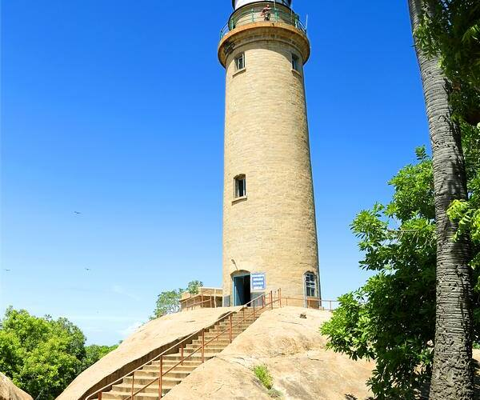
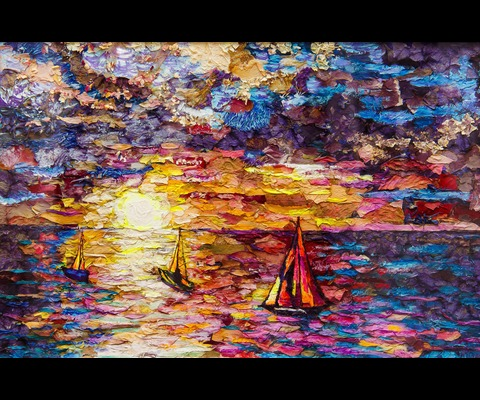
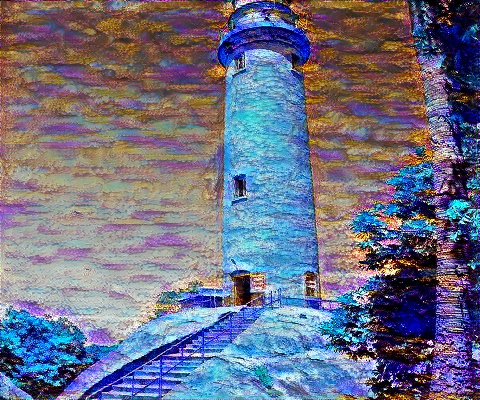
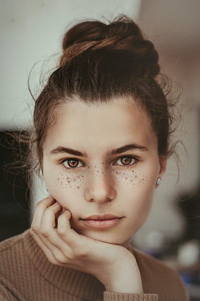
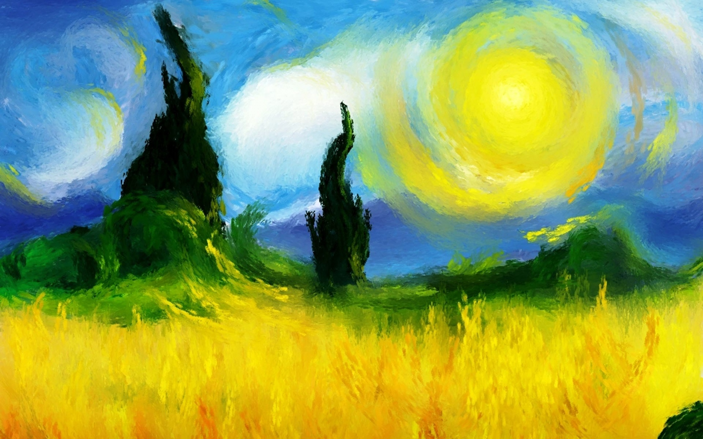
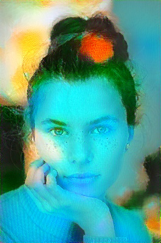

# Neural Style Transfer
Neural Style Transfer (NST) is a deep learning technique that blends the content of one image with the artistic style of another. this way we can impose color style, patterns, texture of style image on content image while keeping its original structure, composition, and semantics intact.
this technique was first conceptualized by **Leon A. Gatys**, **Alexander S. Ecker** and **Matthias Bethge** in the paper [A Neural Algorithm of Artistic Style](https://arxiv.org/pdf/1508.06576).

<!-- ||||
-->
||||
|:-:|:-:|:-:|
|Content image|Style image|Stylized Image|


## Dataset
This model trains and inference at the same time so we can Load any **Content** or **Style** image to this Model.<br>
for refrence i have used some of images from these dataset
- Content images:
    - [unsplash random images collection](https://www.kaggle.com/datasets/lprdosmil/unsplash-random-images-collection)
    - [image captioning dataset random images](https://www.kaggle.com/datasets/shamsaddin97/image-captioning-dataset-random-images)
- Artwork Images:
    - [Images for Style Transfer](https://www.kaggle.com/datasets/soumikrakshit/images-for-style-transfer)
    - [Images for Neural Style Transfer](https://www.kaggle.com/datasets/whale9490/images-from-nga-and-unsplash)


# Process [add some images ]
The models used for extracting features in this process are mostly VGG networks. In this process, we extract features from both the content as well as the style image.

For the content image, features are extracted from the initial part of the network to maintain the structure and semantic integrity in the final output image.

For the style image, features are extracted from multiple layers at various depths in the network to capture a wide range of textures, colors, and patterns that define the artistic style.

These style features are then converted into Gram matrices, which measure the correlations between feature maps. This is done by reshaping the feature map from shape `[C,H,W]` to `[C,H×W]`, then performing a dot product between the feature map and its transpose:<br>
 ***Gⁱ = Fⁱ ∘ (Fⁱ)^t***

During the optimization process, we initialize the generated image (either as white noise or a copy of the content image). <br>We then compute:
- **Content Loss**: the difference between the generated image and the content image features (from a selected layer)
- **Style Loss**: the difference between the Gram matrices of the generated and style images (from multiple layers)

The total loss is a weighted combination of the content and style losses:<br>
***Total Loss = 𝛼 ∘ Content Loss + 𝛽 ∘ Style Loss***

Instead of updating the model weights, we optimize the pixels of the generated image using gradient descent to minimize this total loss. Over several iterations, the generated image gradually evolves to preserve the content structure of the content image while adopting the style patterns of the style image.

> This is how Neural Style Transfer generates a visually compelling output by combining the best of both worlds — content and style — using deep learning.

# Optimization 
in a Neural Network model generally a model is optimize to give best results but in this case rather than model the image is optimize to get desired output. to do so a noise image is introduce which is used as optimizing image when passed throu optimizer which then optimizes and converges to relvent final image

the optimizer used in this repo are `Adam` and `L-BFGS`.
-  **Adam**: it's a common optimizer used in neural network models. we can also use this for image optimization but the number of iteration required for optimization is comparatively greater than L-Bfgs. it is good for fast training but it's convergence rate is slower as compare to other 
-  **L-BFGS**: it's a quasi-Newton method that uses second-order information leading to faster and more stable convergence. it requires fewer iterations to reach a high-quality result. also it's best for static optimization problem. where we are not training on baathc of data.

# Run Code
to Execute this code on local system use this command
```console
python .\neural_style_transfer.py --c_image "Content Image Path" --s_image "Style Image Path" 
```
this is the basic command for geting the stylised image. 
if you want to change some parameter regarding optimization or model add this part in above command
|parameter|command|Default value|
|:-:|:-:|:-:|
|image height|--height|400|
|Content weight|--content_weight|100000.0|
|Style weight|--style_weight|30000.0|
|total variation weight|--tv_weight|10.0|
|Optimizer|--optimizer|L-BFGS|
|Model|--optimizer|L-BFGS|
|optimzation image|--init_method|Content|
|saving image at interval|--saving_freq|-1|

# example
<!-- |Content image| Style Image| output Image|
|:-:|:-:|:-:|
|||| -->

<!-- example 1 -->


 <br>
<!-- example 2 -->


 <br>


<!-- [reference github link](https://github.com/gordicaleksa/pytorch-neural-style-transfer) -->
